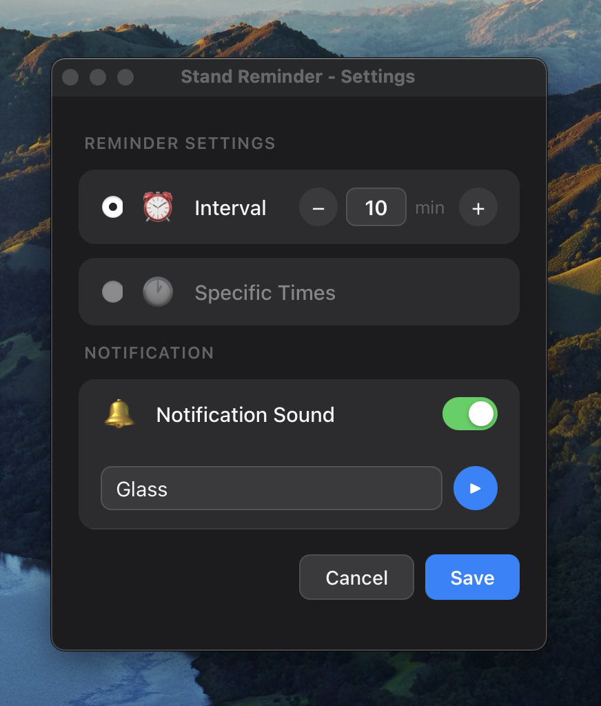
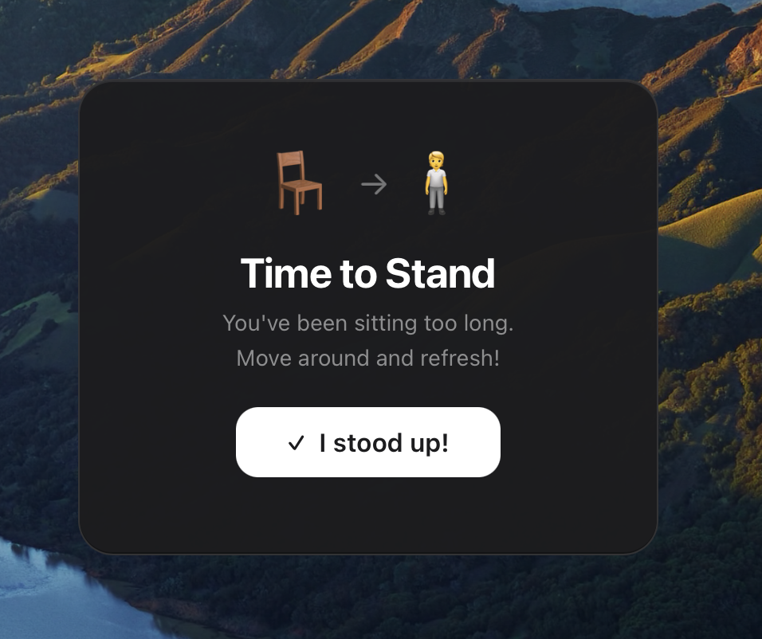

# Stand Reminder

A macOS menu bar app to prevent prolonged sitting.

## Screenshots

<div align="center">
  <table>
    <tr>
      <td align="center">
        <b>Settings</b><br><br>
        
      </td>
      <td align="center">
        <b>Reminder Notification</b><br><br>
        
      </td>
    </tr>
  </table>
</div>

## Background

I use a sit-stand desk, but my particular model has no built-in scheduling feature to raise the desk automatically at set times. As a result, I rarely ended up actually standing.

My first workaround was a SwitchBot finger robot — a small device that physically presses buttons — which I set up to push the desk's raise button on a schedule. It worked for a while, but the Bluetooth connection kept dropping unreliably, so I gave up on that approach.

Rather than fighting with hardware, I built this app as a simple software solution: a menu bar reminder that prompts me to stand up at the right time.

## Features

- **Menu bar app** — Accessible from the menu bar
- **Two reminder modes**
  - **Interval mode** — Reminds you at a set interval (default: 25 minutes)
  - **Specific times mode** — Reminds you at fixed times (multiple times supported)
- **Modal notification** — Appears above all other windows; dismiss with the "I stood up!" button
- **Sleep detection** — Resets the timer after waking from sleep
- **Multi-monitor support** — Notification appears centered on the monitor where the cursor is
- **Notification sound** — Choose from built-in macOS sounds; can be disabled
- **Dark mode support**

## Requirements

- macOS (Apple Silicon)

## Installation

Download the latest `.dmg` from the [Releases](https://github.com/shintarou-akao/stand-reminder/releases) page.

1. Open the `.dmg` file and drag **Stand Reminder** to your Applications folder
2. Run the following command in Terminal to remove the quarantine attribute:
   ```bash
   xattr -cr "/Applications/Stand Reminder.app"
   ```
3. Launch the app normally

> **Note:** The pre-built binary is for Apple Silicon (M1/M2/M3). Intel Mac users need to build from source.

## Build from Source

### Prerequisites

- [Rust](https://www.rust-lang.org/tools/install) (latest stable)
- [Node.js](https://nodejs.org/) v18 or later
- [pnpm](https://pnpm.io/)

```bash
# If pnpm is not installed
npm install -g pnpm
```

### Build

```bash
git clone https://github.com/shintarou-akao/stand-reminder.git
cd stand-reminder
pnpm install
pnpm tauri build
```

The built app will be generated at `src-tauri/target/release/bundle/macos/Stand Reminder.app`.

### Development

```bash
pnpm tauri dev
```

## Tech Stack

- **Frontend** — React 19 + TypeScript + Zustand + Vite
- **Backend** — Rust + Tauri v2 + tokio

## License

MIT License — see [LICENSE](LICENSE) for details.
